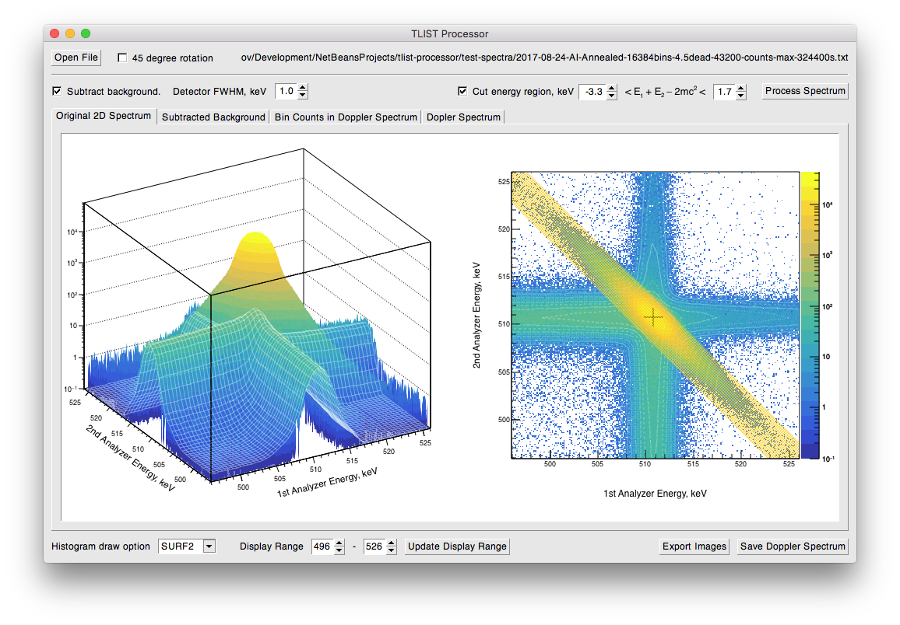

Doppler broadening of annihilation radiation is a powerful method for studying point defects in materials. At SelimLab we have a fully digital spectrometer that utilizes Canberra's Ge high purity detectors and LYNX digital signal analyzers. Facility outputs two-dimentional spectra that represent pairs of photon energy events, registered simultaneously.

We developed a special software that processes 2D energy spectrum and outputs 1D doppler-broadened spectrum. Sharing is caring. Enjoy!

* Supports the file format output by Canberra's TLIST Data Scanner app.
* Fits and subtracts the background sleeves related to three-gamma annihilation events.
* The good old method of filtering the events on the diagonal is implemented.
* Exports doppler-broadened E1-E2 spectrum.
* Saves raster graphic images.

    <a href="https://github.com/petrstepanov/tlist-processor" rel="nofollow" class="btn wrap btn-primary btn-lg"><strong>Download TLIST Processor</strong> on GitHub</a>

The app is cross-platform, built with CERN ROOT framework. GUI is based on the Xclass'95 widget library. Grab the source code or run precompiled binaries for MacOS, Ubuntu and Windows.

Shout us some feedback at <a title="Contact us" href="mailto: &#102;&#097;&#115;&#101;&#108;&#105;&#109;&#064;&#098;&#103;&#115;&#117;&#046;&#101;&#100;&#117;">&#102;&#097;&#115;&#101;&#108;&#105;&#109;&#064;&#098;&#103;&#115;&#117;&#046;&#101;&#100;&#117;</a>.

<small><b>Acknowledgments</b>. Petr Stepanov honors special thanks to <a href="https://www.researchgate.net/profile/Dmitry_Zvezhinskiy" target="_blank" rel="nofollow">Dmitry Zvezhinsky</a> – his scientific advisor in the <a href="http://www.itep.ru/eng/" target="_blank" rel="nofollow">Institute for Theoretical and Experimental Physics</a>.</small>
