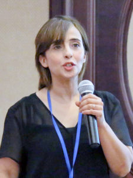

    

        
Dr. Selim has a broad research program in the field of oxides and wide band gap materials. Her research covers a wide range of topics in semiconductors and dielectrics including synthesis, thin film technology, optoelectronics, transport properties, and defect studies. She is expert on positron annihilation and luminescence spectroscopies and has been very active in developing new techniques and building instrumentation for defect and luminescence measurements.

        
Selim has earned international recognition in a number of scientific communities that has been reflected in selecting her to be:

        <ol class="spaced">
            <li>One of the <a href="http://www.ppc12.umcs.pl/?id=4&amp;sid=1" rel="nofollow">13 members of the International Scientific Committee of Positron and Positronium Chemistry</a> since November 2014.</li>
            <li><a href="http://www.uta.edu/physics/meetings/3ppp/com_adv.html" rel="nofollow">Secretary of the International Academic Advisory Committee</a> on “Persistent and Photostimulable Phosphors” since May 2015.</li>
            <li>One of the <a href="https://wiki.jlab.org/pwgwiki/index.php/Main_Page" rel="nofollow">10 members of Positron Working Group at the Thomas Jefferson Laboratory</a> (JLab).</li>
        </ol>
        
Selim is editor of scientific book, author of 78 peer reviewed articles and two book chapters and sole inventor of 3 patents, 1 issued in 2016 and 2 pending, in addition to her significant invention at the beginning of her career “Accelerator based positron annihilation spectroscopy” technique which extends positron annihilation spectroscopy to numerous new fields in materials science. The technique is known today as Gamma induced positron spectroscopy (GIPS); it has been recently adopted to build a unique materials research facility at the superconducting accelerator facility in Dresden, Germany. <a href="http://www.hzdr.de/db/Cms?pNid=1732" rel="nofollow">ELBE – Center for High-Power Radiation Sources - Helmholtz-Zentrum Dresden-Rossendorf</a>, HZDR.

        <h2>Our major research projects include</h2>
        <ul class="spaced mb-5">
            <li>Fundamental and applied research on <strong>wide band gap materials</strong>. Synthesis and characterization.</li>
            <li><strong>Defect studies and radiation damage</strong>. We are experienced in following metods: XRD, PALS, DBR, FTIR.</li>
        </ul>
    

    

        

            

                

                    
                

                

                    

                        <h2 class="h4 mt-0 mb-1 card-title">Dr. Farida A. Selim</h2>
                        
<small><i>Associate Professor</i></small>

                        
<small>Department of Physics and Astronomy, Center for Photo- chemical
                                Sciences. Bowling Green State University, Overman Hall 172</small>

                        

                        

                            <a href="mailto:faselim@bgsu.edu">faselim@bgsu.edu</a> 
                            <a href="tel:+14193729956">+1 (419) 372-9956</a>
                        

                    

                

            

        

    

