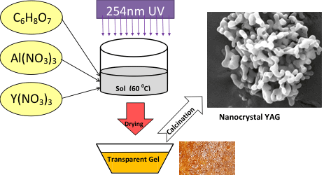
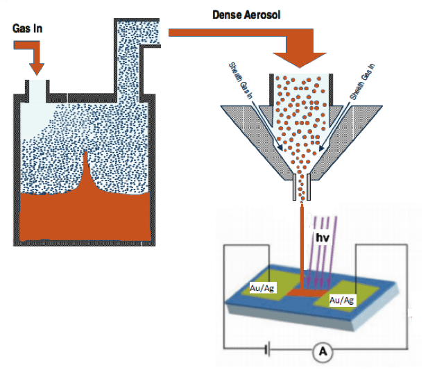
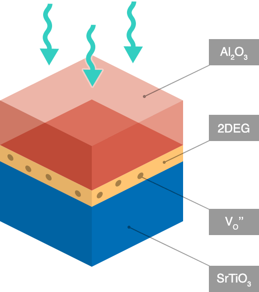
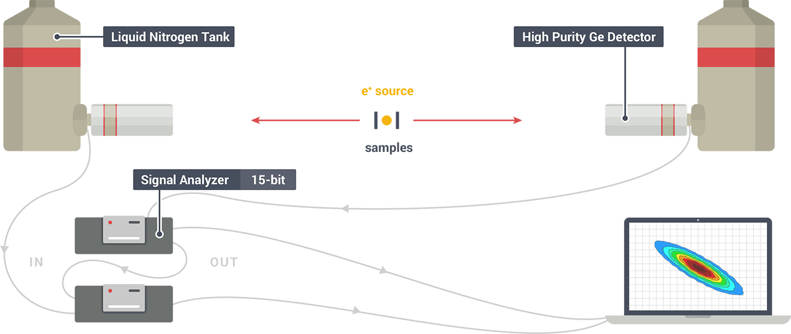

<h2>Photo-chemical synthesis of nanomaterials</h2>

    

        
    

    

        
We explore the use of photons with variable wavelength and intensity  to control the particle size and morphology and deposit nanocrystalline films of semiconductors and dielectrics for LEDs and energy applications.

        
The growth processes take place in our class 100 clean room to obtain high purity materials by employing our wide range  illumination sources  and panels.

    

<h2>ZnO: fundamental physics and optoelectronic devices</h2>

    

        
    

    

        
ZnO Research in our lab focuses on synthesis and characterization of  ZnO thin films and bulk crystals for optoelectronic devices and TCO applications while investigating the fundamental physics of defects  and  optoelectronic properties of ZnO, one of the most complex binary system  in terms of its defect and related solid-state electronic properties.

    

## Multifunctional complex oxides

    

        
    

    

        

        
We explore novel physical phenomena such as the formation of 2DEG and giant photoconductivity  induced in  multifunctional complex oxides by generating and tuning point defects at the interfaces.

        
Following epitaxial growth by MOCVD or ALD, defects  are populated by photo- and thermal processing using our unique gas mixing panel with atomic precision control.

    

## Positron annihilation spectroscopy

We developed the first fully digital Coincidence Doppler broadening spectrometer. It is expected to greatly improve the sensitivity of Doppler broadening in probing the electron momentum distributions and identifying the chemical environment around defects.

Our lab hosts a positron lifetime spectrometer and a coincident Doppler broadening system that provide crucial tools  for defect studies and assist us in revealing the source of many interesting phenomena.