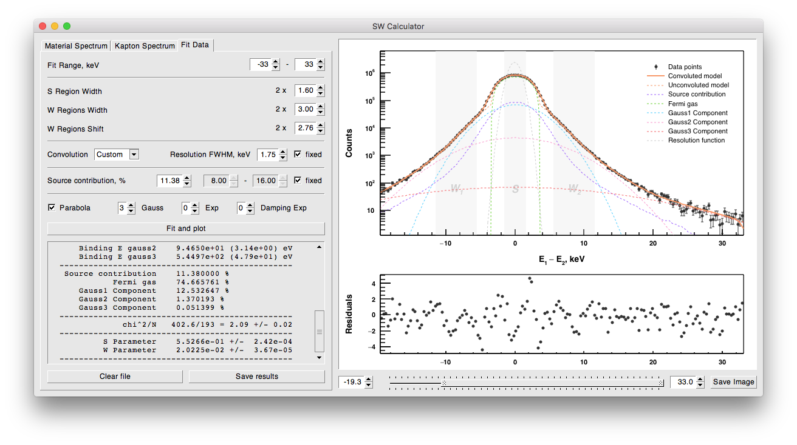

The app **calculates S and W parameters from the Doppler-broadened 511 peak** of ionizing radiation.

SWCalculator might be quite useful for those physicists who work with positron spectroscopy. Main app features are:

* Supports a variety of different formats of input data files.
* Fit the 511 peak with four gaussian functions and subtract atan() background.
* Calculate S and W parameters for a series of spectra.
* Export data points, fit and chi^2 to a .CSV file.
* Save raster fit images.

    <a href="https://github.com/petrstepanov/sw-calculator" rel="nofollow" class="btn btn-primary btn-lg"><strong>Download SW Calculator</strong> on GitHub</a>

The app is cross-platform, developed using CERN ROOT framework. GUI is based on the Xclass'95 widget library. You can download this software from the GitHub repository - download button above. As well as the source code - you can find precompiled binaries for MacOS, Ubuntu and Windows.

Shout us a word at <a title="Contact us" href="mailto: &#102;&#097;&#115;&#101;&#108;&#105;&#109;&#064;&#098;&#103;&#115;&#117;&#046;&#101;&#100;&#117;">&#102;&#097;&#115;&#101;&#108;&#105;&#109;&#064;&#098;&#103;&#115;&#117;&#046;&#101;&#100;&#117;</a>. We'd love to hear any recommendations</a> to make the software better.

<small><b>Acknowledgments</b>. Petr Stepanov honors special thanks to <a href="https://www.researchgate.net/profile/Dmitry_Zvezhinskiy" target="_blank" rel="nofollow">Dmitry Zvezhinsky</a> – his scientific advisor in the <a href="http://www.itep.ru/eng/" target="_blank" rel="nofollow">Institute for Theoretical and Experimental Physics</a>.</small>
