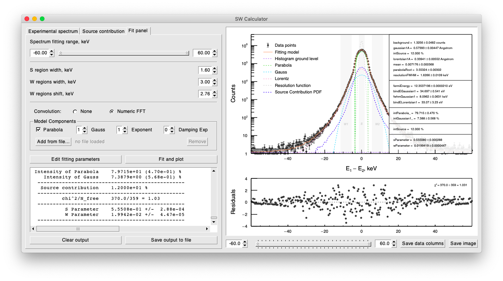
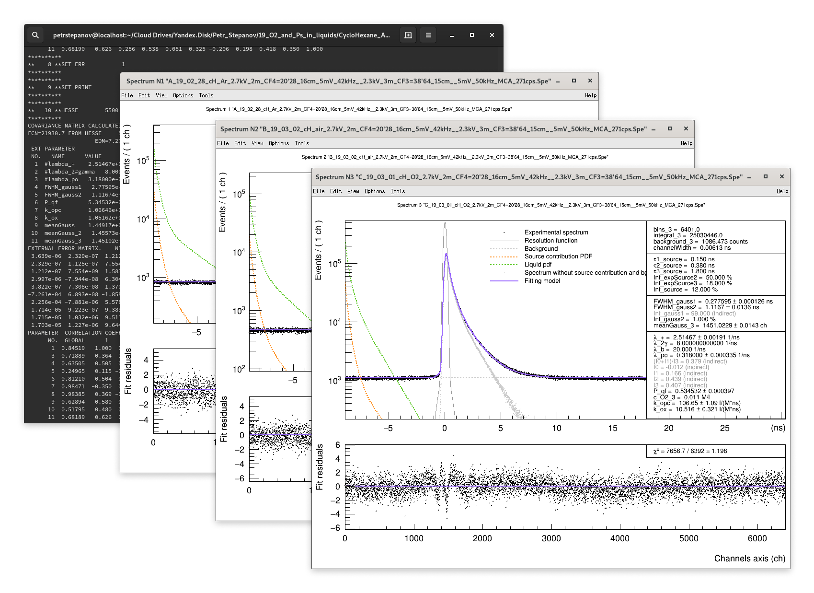

As well as we develop new hardware facilities we do software too. Most of our software is open-source and released under the General Public License. Hence our products are accessible to everyone. We host apps at Github which makes it easy to collaborate, fork and access our applications. Below find our public products.

    

        
    

    

        <h5 class="mt-4 mb-3">TLIST Processor</h5>
        
Software is designed to process two-dimensional energy spectra and output one-dimensional coincidence broadened Doppler spectrum.

        
A background fitting and subtraction technique is developed and implemented.

        
<code class="text-black-50">C++, CERN ROOT framework, GNU Automake</code>

        
<a href="https://github.com/petrstepanov/tlist-processor" class="btn btn-primary" rel="nofollow" target="_blank">View on GitHub</a>

    

    

        
    

    

        <h5 class="mt-4 mb-3">SW Calculator</h5>
        
Program calculates S and W parameters of the 511 keV peak of the annihilation radiation. Software estimates values of the binding electron energies by fitting the CDB spectrum with contributions from e+ annihilation on electrons with different wave functions.

        
Electrons from conduction band contribute into the spectrum as an inverted parabola. Upon the shape of the parabola we calculate Fermi energy.

        
<code class="text-black-50">C++, CERN ROOT framework, GNU Automake</code>

        
<a href="https://github.com/petrstepanov/sw-calculator" class="btn btn-primary" rel="nofollow" target="_blank">View on GitHub</a>

    

    

        
    

    

        <h5 class="mt-4 mb-3">RooPositron</h5>
        
A flexible terminal-based positron lifetime fitting software. Graphical user interface is in progress.

        
Software supports deconvolution of lifetime spectra into conventional multiexponential model as well as trapping model. Supports integration of models with custom fitting parameters.

        
<code class="text-black-50">C++, CERN ROOT framework, GNU Automake</code>

        
<a href="https://github.com/petrstepanov/sw-calculator" class="btn btn-primary" rel="nofollow" target="_blank">View on GitHub</a>

    

