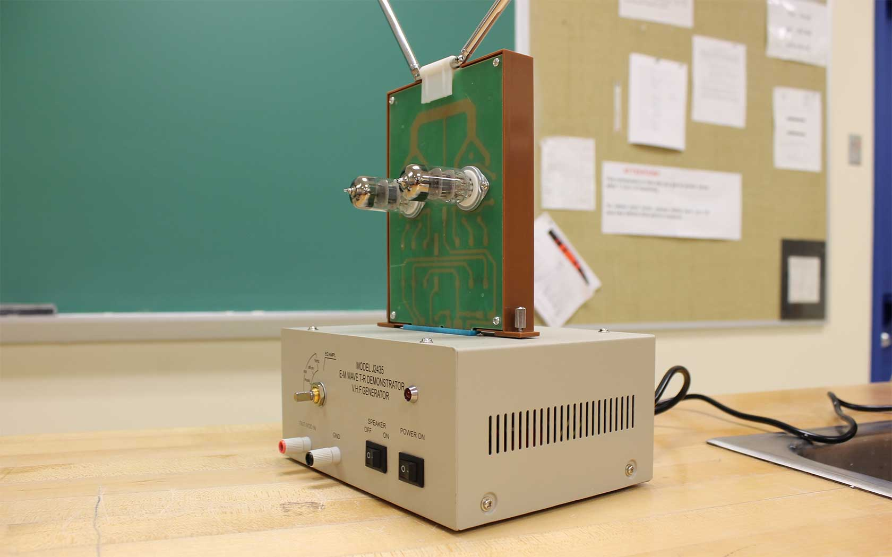
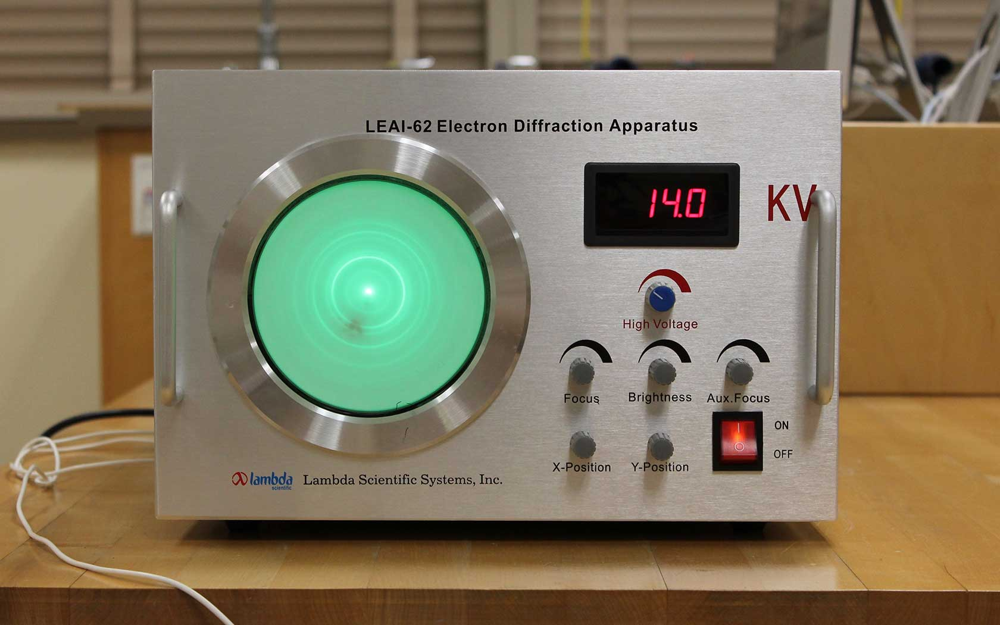
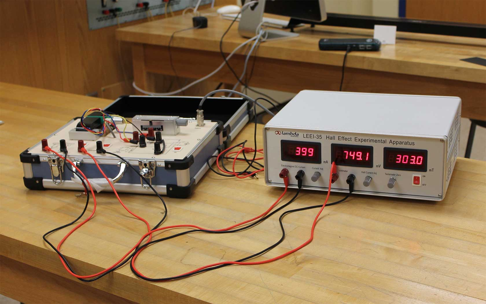
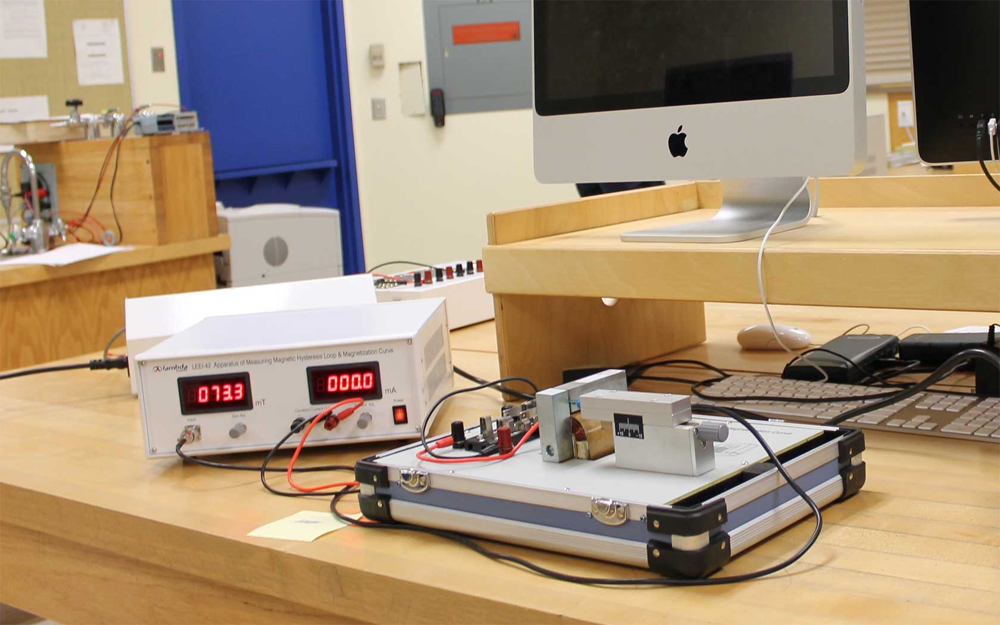
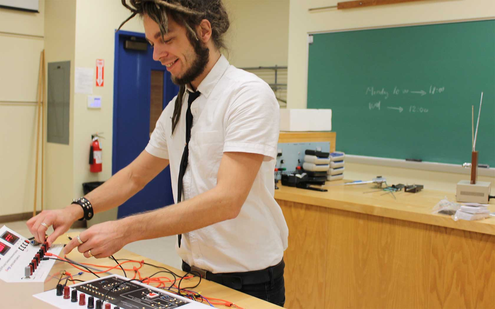
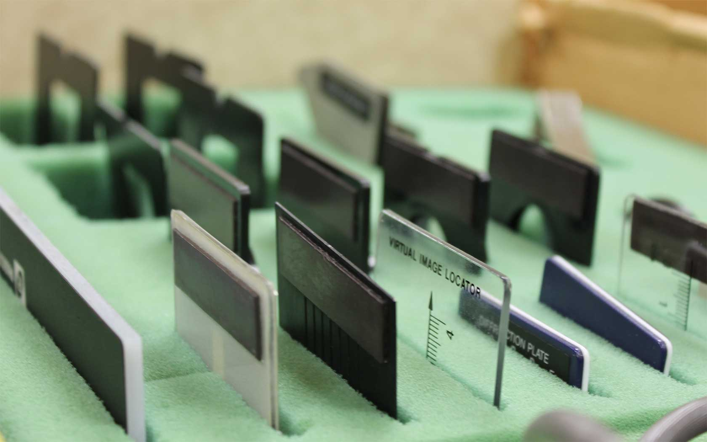
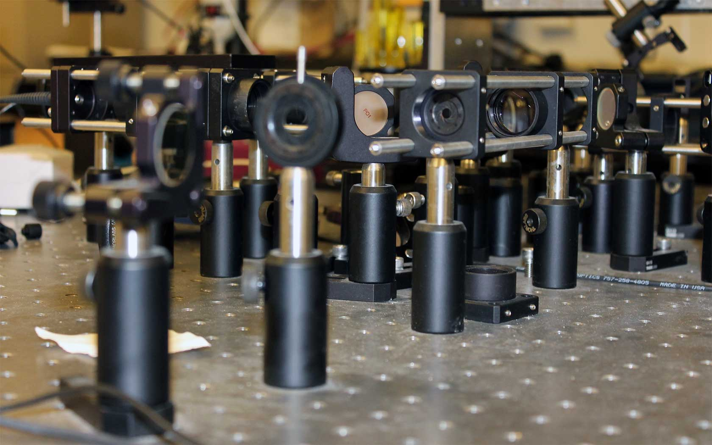

## Modern Physics Laboratory (Fall 2014)

    

        
    

    

        
    

    

        
    

    

        
    

    

        
    

## Thermal Physics and Optics (Spring 2014)

    

        
    

    

        
    

